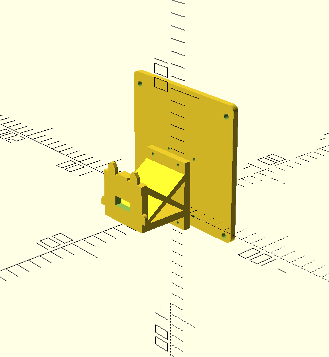

Acer R231bmid Vesa Adapter
==========================

An enthusiast's study on translating and customizing OpenSCAD
files to SolidPython while solving a *domestic issue*.

## Requirements

- OpenSCAD
- SolidPython

## Print settings

To follow...

## Hardware

**Screws**

- M5 x 4
- M3 x 4

## Reference

- [VESA Mount Adapter Bracket for Acer Monitor by pschoen](https://www.thingiverse.com/thing:3101517/files)
